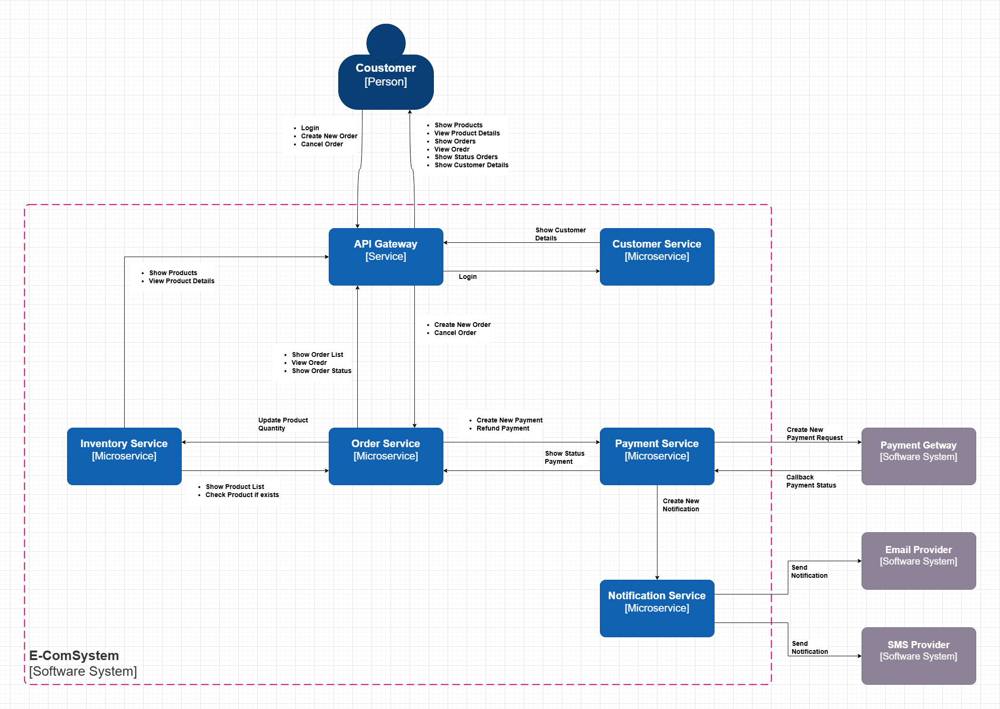
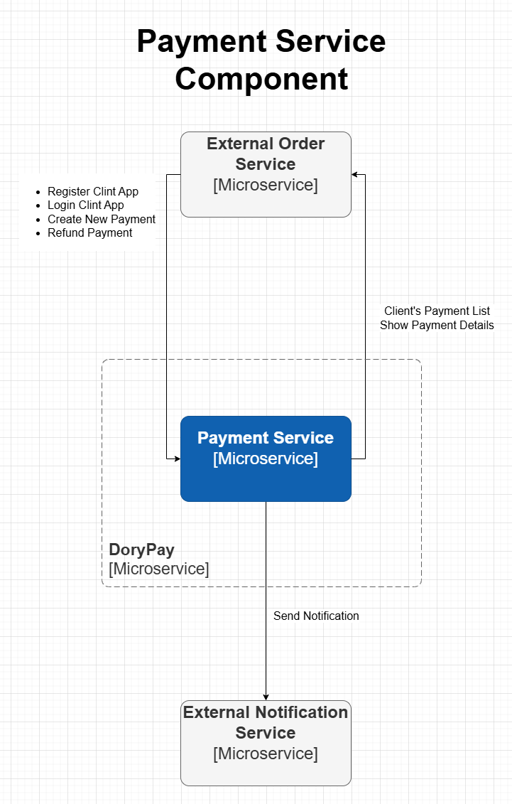
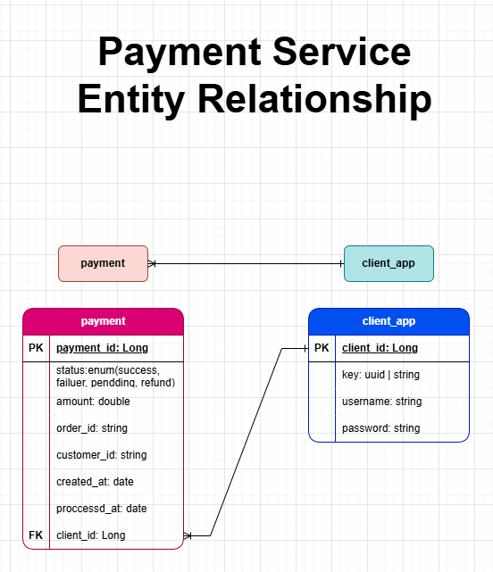

# Payment Service API Documentation (Dory Pay)

---

## Team Work

- Eng. Rawan Medhat
- Eng. Mohammad Asaad
- Eng. Mahmoud Hany
- Eng. Kareem Mohammad

---

## System Architecture

This project is part of a Microservices-based system, where each service is responsible for a specific business domain.
The system is designed to be modular, scalable, and easy to maintain.

## Services Overview

The system consists of the following services:

### Payment Service

- Handles payment processing, refunds, and payment status management.

### Notification Service

- Responsible for sending notifications (email, SMS, etc.).

### Inventory Service

- Manages product stock and availability.

### Customer Service

- Handles customer data and profiles.

### Order Service

- Manages orders and order lifecycle.

---

## Resource Diagram

### 1. C4 Context (Main Application Diagram)



### 2. C4 Context (Payment Service Component Diagram)



### 3. Entity Diagram



---

## Get Started

Follow these steps to run the Payment Service locally:

### Prerequisites

- Docker installed on your machine.
- API testing tool like Postman or APIDog.

### Service Information

- **Port**: 8084
- **Database**: H2 (in-memory, embedded)
- **API Documentation**: Accessible at `http://localhost:8084/ui-swagger.html` after starting the service.
- **API Testing**: You can export API doc json file from link `http://localhost:8084/v3/api-docs` and import file in _APIDog_ or _Postman_, you can test all endpoints.
- **Database Console**: Accessible at `http://localhost:8084/h2-console` to view stored data.

### Run with Docker

#### Create New Network

Create new public network to connect the service.

- Don't run this command if you have alrady exists public network name `e-comsys-microservices-net`.

```bash
docker network create e-comsys-microservices-net
```

#### Start the Service

From the project root folder, run:

```bash
docker-compose up -d
```

This will build the image (if not built already) and start the container.

#### Verify the Service

Check if the container is running:

```bash
docker-compose ps
```

#### Stop the Service

To stop and remove containers:

```bash
docker-compose down
```

You should see the container payment-service running and mapped to port 8084.

### Test the API

- Use your API client (Postman/APIDog) to test endpoints.
- Base URL: http://localhost:8084/api/v1
- API Key required for payment endpoints (if configured).

## API Design

Base URL:

```code
http://{domain-or-IPv4}:8084/api/v1
```

## Authentication

### 1. Register New Client

Create a new client application.

Method: `POST`

Endpoint:

```code
/auth/register
```

Request Body

```json
{
  "username": "Kareem",
  "password": "123456"
}
```

Responses

200 OK

```json
{
  "key": "jtu3ui4-yrui-trog-utiyteer"
}
```

403 Forbidden

```json
{
  "message": "username exists"
}
```

### 2. Login Client

Authenticate existing client.

Method: `POST`

Endpoint:

```code
/auth/login
```

Request Body

```json
{
  "username": "Kareem",
  "password": "123456"
}
```

Responses

200 OK

```json
{
  "key": "jtu3ui4-yrui-trog-utiyteer"
}
```

401 Unauthorized

```json
{
  "message": "username not found"
}
```

## Payments

All payment endpoints require `apikey` in request header.

```code
apikey: dfyuf-nfdfsh-nfnfh-fdjdhjf
```

### 3. Create New Payment

Create a payment for an order.

Method: `POST`

Endpoint:

```code
/payments
```

Headers

```json
{
  "apikey": "dfyuf-nfdfsh-nfnfh-fdjdhjf"
}
```

Request Body

```json
{
  "order_id": 10,
  "customer_id": 20,
  "amount": 44.99
}
```

Responses

200 OK

```json
{
  "id": 1,
  "status": "success | failure | pending",
  "order_id": 10,
  "customer_id": 20,
  "amount": 40.99,
  "processed_at": "19-12-2026",
  "created_at": "18-12-2026"
}
```

422 Validation Error

```json
[
  {
    "field": "customer_id",
    "message": "customer required"
  }
]
```

406 Not Acceptable

```json
{
  "message": "order process duplicated"
}
```

### 4. List Customer Payments

Retrieve all payments for a specific customer.

Method: `GET`

Endpoint:

```code
/payments/{customerID}?status=success
```

Headers

```json
{
  "apikey": "dfyuf-nfdfsh-nfnfh-fdjdhjf"
}
```

Responses

200 OK

```json
[
  {
    "id": 1,
    "status": "success | failure | pending | refunded",
    "order_id": 10,
    "customer_id": 20,
    "amount": 40.99,
    "processed_at": "19-12-2026",
    "created_at": "18-12-2026"
  }
]
```

404 Not Found

```json
{
  "message": "no customer exists"
}
```

### 5. Get Payment Details

Retrieve details of a specific payment.

Method: `GET`

Endpoint:

```code
/payments/{id}
```

Headers

```json
{
  "apikey": "dfyuf-nfdfsh-nfnfh-fdjdhjf"
}
```

Responses

200 OK

```json
{
  "id": 1,
  "status": "success | failure | pending | refunded",
  "order_id": 10,
  "customer_id": 20,
  "amount": 40.99,
  "processed_at": "19-12-2026",
  "created_at": "18-12-2026"
}
```

404 Not Found

```json
{
  "message": "no payment exists"
}
```

### 6. Refund Payment

Refund a specific payment.

Method: `POST`

Endpoint:

```code
/payments/{id}/refund
```

Headers

```json
{
  "apikey": "dfyuf-nfdfsh-nfnfh-fdjdhjf"
}
```

Responses
200 OK

```json
{
  "id": 1,
  "status": "refunded",
  "order_id": 10,
  "customer_id": 20,
  "amount": 40.99,
  "refunded_at": "20-12-2026",
  "created_at": "18-12-2026"
}
```

404 Not Found

```json
{
  "message": "no payment exists"
}
```

406 Not Acceptable

```json
{
  "message": "payment cannot be refunded"
}
```

## Payment Status List

Possible payment statuses:

- success
- failure
- pending
- refunded
